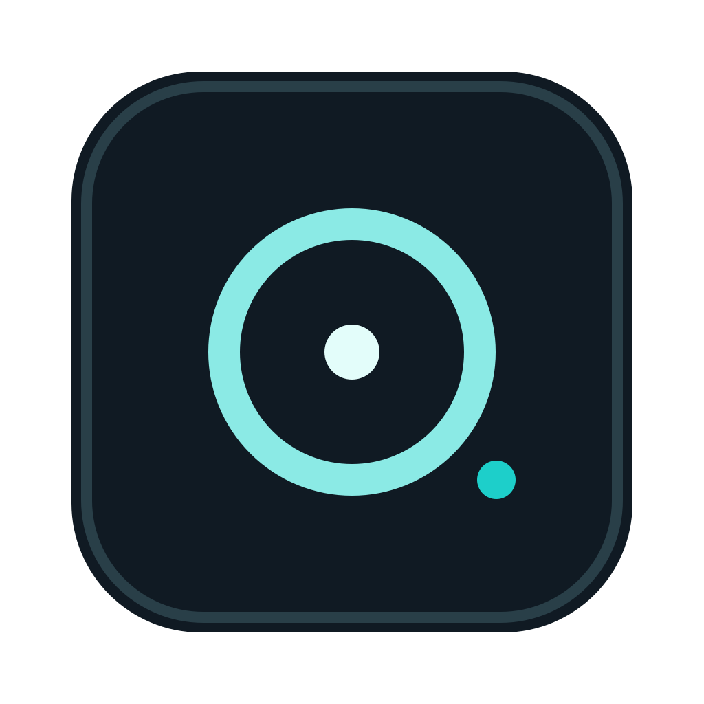

<p align="center">
  
</p>

# MoodleLens

[](https://github.com/volodymyr-yelisieiev/MoodleLens/actions/workflows/ci.yml)
[](https://github.com/volodymyr-yelisieiev/MoodleLens/releases)
[](LICENSE.md)


MoodleLens is a macOS research tool for studying how current AI agents affect Moodle-based assessment. It captures the current screen, extracts compact Moodle task evidence from a supported browser when permission is granted, and returns an evidence-bound answer through either an OpenAI API key or the user's authenticated local Codex CLI session.

The project is an educational demo and research artifact. Its intended audience is Moodle developers, education researchers, and policy stakeholders evaluating whether classic Moodle quizzes, assignments, and take-home assessments still measure student work in an AI-agent era. It is not affiliated with Moodle HQ, JKU, or OpenAI.

Settings and Ask windows are configured for best-effort macOS capture exclusion, but no app can guarantee invisibility across every recorder, OS build, browser, conferencing stack, or proctoring environment. Verify the exact setup before any demo.

## Install

Download `MoodleLens-...-macos.dmg` from [Releases](https://github.com/volodymyr-yelisieiev/MoodleLens/releases), open it, drag `MoodleLens.app` to `Applications`, then open the app from Applications.

Current public DMGs may be ad-hoc signed unless release signing secrets are configured. If macOS blocks first launch, use Control-click -> Open once. Privacy permissions persist reliably across updates only when releases are signed with the same Developer ID or Apple Development identity.

Native in-app updates are available from the first public release onward through Settings -> Check for Updates.

## Setup

First launch opens setup inside the app. Choose a provider:

- OpenAI API key, stored in macOS Keychain.
- Codex CLI, using the existing local `codex login` session.

MoodleLens never reads, copies, prints, or stores Codex OAuth tokens. The Codex provider only checks the local CLI status and runs `codex exec --ephemeral --sandbox read-only`.

## Permissions

MoodleLens needs:

- Screen Recording for current-display screenshots.
- Accessibility for global hotkeys.
- Input Monitoring only if hotkeys still do not fire after Accessibility is enabled.
- Automation for optional Moodle Browser Context from Chrome, Arc, Edge, Brave, or Chromium.

Permission prompts are only triggered from Settings via `Grant / Repair`. After granting Screen Recording, restart the app.

`Grant / Repair` first removes the current bundle's existing TCC row for that permission, then asks macOS to add it back. This avoids stale denied/granted rows from older local builds.

For Browser Context in Chrome-family browsers, also enable `View -> Developer -> Allow JavaScript from Apple Events` in the browser. MoodleLens logs Browser Context status without page text at `~/Library/Logs/MoodleLens/browser-context.log`.

## Moodle Behavior

Ask is intentionally evidence-bound:

- If no supported browser or Moodle page is detected, it says so instead of guessing.
- If a Moodle page is detected but no task can be extracted, it says no task was found.
- If multiple questions or tasks are present on the page, answers are numbered.
- Browser Context is treated as structured evidence for question text, choices, selected values, dropdowns, feedback, and assignment descriptions.
- Screenshots are current display/viewport captures, not guaranteed full-page browser captures.

## Shortcuts

Default shortcuts:

- `⌥G`: open or focus Settings; press again while Settings is focused to close it.
- `⌥A`: Ask from the current Moodle page evidence.
- `⌥B`: toggle the last answer bubble.
- `⌥C`: clear Ask history.

Shortcuts can be changed in Settings -> Hotkeys.

Ask history is in memory for the current app session. The current session history can be viewed and cleared in Settings.

## Development

```bash
DEVELOPER_DIR=/Applications/Xcode.app/Contents/Developer \
xcodebuild test \
  -project MoodleLens.xcodeproj \
  -scheme MoodleLens \
  -destination 'platform=macOS' \
  CODE_SIGNING_ALLOWED=NO \
  CODE_SIGNING_REQUIRED=NO
```

```bash
scripts/verify-local.sh
scripts/package-share.sh v1.0.0
scripts/generate-appcast.sh v1.0.0
hdiutil verify dist/MoodleLens-v1.0.0-macos.dmg
```

Reset local app state:

```bash
scripts/reset-moodlelens.sh
```

Reset local app state and remove release artifacts:

```bash
scripts/reset-moodlelens.sh --include-dist
```

For notarized builds, provide both signing inputs:

```bash
MOODLELENS_SIGN_IDENTITY="Developer ID Application: Your Name (TEAMID)" \
MOODLELENS_NOTARY_PROFILE="notarytool-keychain-profile" \
scripts/package-share.sh v1.0.0
```

For stable local TCC permissions without notarization, provide only `MOODLELENS_SIGN_IDENTITY`. Gatekeeper-friendly public releases should also provide notarization credentials.

## AI-Assisted Notice

MoodleLens was built with heavy AI assistance. Treat it like a young open-source macOS utility: review permissions, test your exact recording/demo setup, and expect rough edges. Bug reports and focused pull requests are welcome.

## Contributing

Please open an issue before larger feature work. For bugs, include macOS version, app version, provider mode, steps to reproduce, expected behavior, actual behavior, and screenshots or logs if they do not contain secrets. For pull requests, run `xcodebuild test` and `scripts/verify-local.sh`, keep the diff focused, and update README/docs when behavior changes.

## Privacy

- API keys are stored in Keychain under the app's internal bundle-id service.
- Temporary screenshots live under the app temp directory and are deleted after success, errors, app quit, or clear.
- Ask history is in memory for the current session.
- MoodleLens does not collect telemetry.
- Capture exclusion is best-effort and must be verified on the exact target capture stack.

## Attribution

See [NOTICE.md](NOTICE.md).

## License

MIT. See [LICENSE.md](LICENSE.md).
